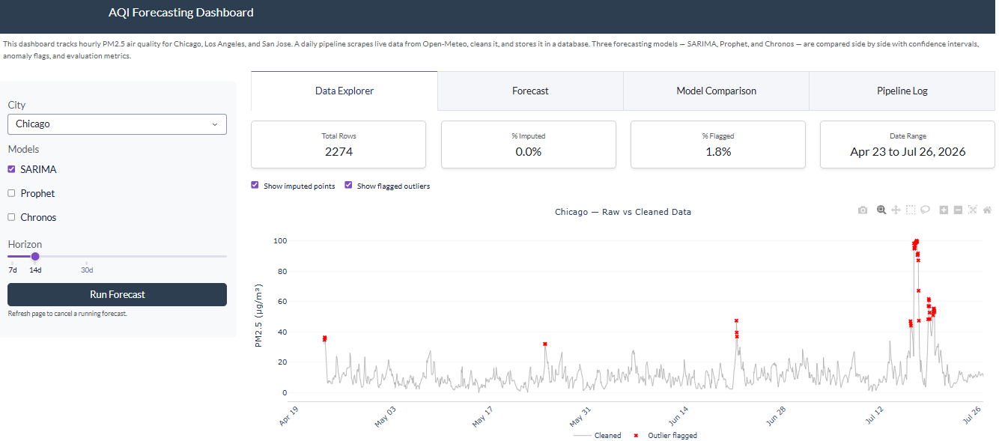
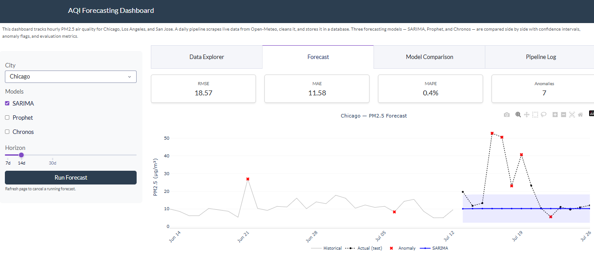
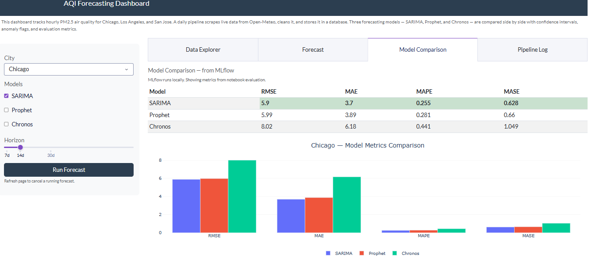
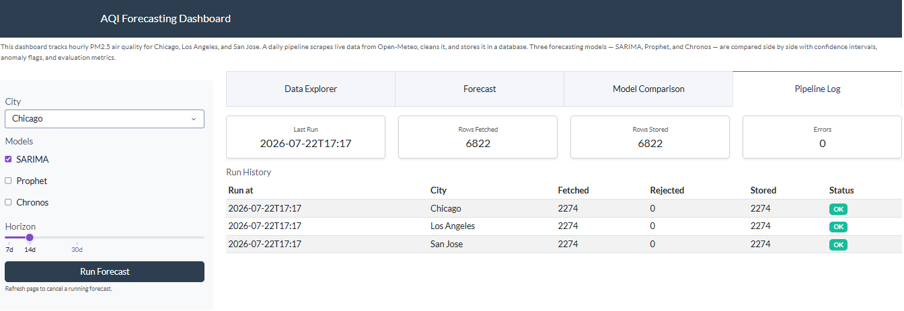

# AQI Time Series Forecasting Dashboard

A full-stack data science project that scrapes live air quality data, cleans it, stores it, and serves forecasts from three models through an interactive dashboard.

**Live demo:** https://web-production-134ad.up.railway.app

---

## What it does

A daily pipeline pulls hourly PM2.5 readings for Chicago, Los Angeles, and San Jose from the Open-Meteo API. The data gets validated, cleaned, and stored in SQLite. The dashboard lets you pick a city and model, set a forecast horizon, and see forecasts with confidence intervals, anomaly flags, and evaluation metrics.

> **Note on data:** The current deployment uses 3 months of historical data due to infrastructure constraints (ephemeral filesystem on Railway free tier). With persistent storage, this can easily scale to multiple years of data, enabling richer seasonal patterns, longer-term trend detection, and more robust model training.

---

## Screenshots






---

## Cities

Chicago, IL / Los Angeles, CA / San Jose, CA

---

## Models

All three models were configured based on EDA findings rather than defaults:

| City | Frequency | Seasonal period | Prophet mode |
|---|---|---|---|
| Chicago | Daily | m=7 (weekly) | Additive |
| Los Angeles | Hourly | m=24 (daily) | Multiplicative |
| San Jose | Hourly | m=24 (daily) | Multiplicative |

**SARIMA** uses pmdarima's auto_arima to find the best order automatically. EDA confirmed d=0 across all cities.

**Prophet** uses city-specific seasonality and changepoint flexibility. US holidays plus a July 4th fireworks event window are added for Chicago.

**Chronos** is Amazon's pre-trained foundation model (chronos-t5-small). Zero-shot, no training needed.

**Anomaly detection** combines rolling IQR on raw values with IQR on STL residuals. A point gets flagged if either method catches it.

---

## Stack

| Layer | Tools |
|---|---|
| Data ingestion | Open-Meteo API, requests, tenacity |
| Data cleaning | Pydantic, pandas |
| Storage | SQLite, SQLAlchemy |
| Models | pmdarima, prophet, chronos-forecasting, torch |
| Experiment tracking | MLflow |
| Orchestration | Prefect (daily 6am schedule) |
| Dashboard | Plotly Dash, dash-bootstrap-components |
| Containerization | Docker |
| CI/CD | GitHub Actions |
| Deployment | Railway |

---

## Running locally

```bash
git clone https://github.com/hanishavemireddy/air-quality-forecasting.git
cd air-quality-forecasting

python -m venv venv311
venv311\Scripts\activate

pip install -r requirements-prod.txt

# seed the database
python pipeline/run_pipeline.py --backfill 90

# start the dashboard
python -m dashboard.app
# open http://localhost:8050

# MLflow experiment tracking (local only)
mlflow ui
# open http://localhost:5000

# Prefect orchestration UI (local only)
prefect server start
# open http://localhost:4200
```

---

## What's been built

- [x] Live API scraping with retry logic
- [x] 4-step cleaning pipeline (validation, outlier flagging, imputation, dedup)
- [x] SQLite database with raw, cleaned, and audit log tables
- [x] 90-day historical backfill
- [x] EDA notebook (stationarity, ACF/PACF, STL, distributions, anomalies)
- [x] SARIMA, Prophet, and Chronos with shared interface
- [x] Anomaly detection combining raw IQR and STL residuals
- [x] MLflow experiment tracking for all 9 model/city combinations
- [x] Prefect orchestration with daily schedule
- [x] Docker + docker-compose
- [x] GitHub Actions CI/CD (tests on push, auto-deploy on green)
- [x] 4-tab Plotly Dash dashboard deployed on Railway

---

## Design decisions

Raw and cleaned data are stored separately so the cleaning pipeline is re-runnable without losing anything. Outlier rows are flagged rather than deleted. Every database write is idempotent. Model settings were chosen based on EDA, not defaults.